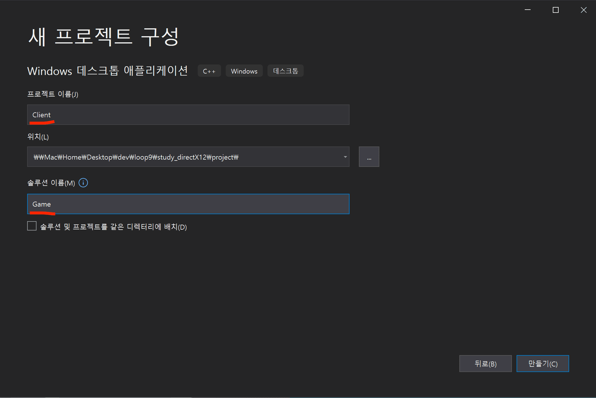
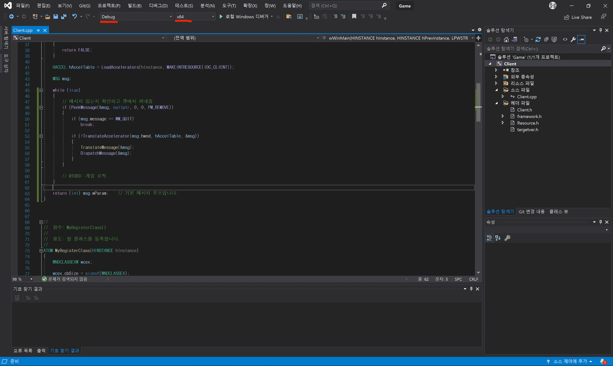
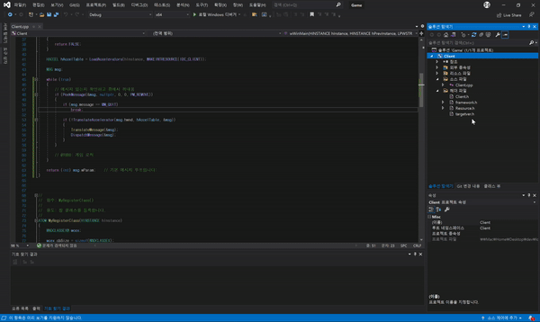
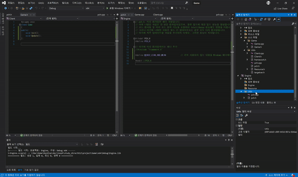
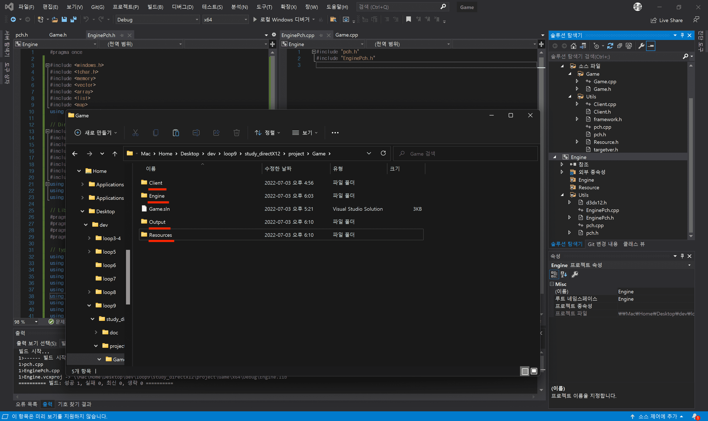

Table of Contents

- [프로젝트 설정](#프로젝트-설정)
- [장치 초기화](#장치-초기화)
- [삼각형 띄우기](#삼각형-띄우기)
- [Constant Buffer](#constant-buffer)
- [Root Signature](#root-signature)
- [Index Buffer](#index-buffer)
- [Texture Mapping](#texture-mapping)
- [Depth Stencil View](#depth-stencil-view)

---

## 프로젝트 설정

1. 프로젝트 생성

   |                Window 데스크톱 애플리케이션 프로젝트 생성                 |          Project - `Client`, Solution - `Game`          |
   | :-----------------------------------------------------------------------: | :-----------------------------------------------------: |
   |  |  |

2. 입력이 없어도 프로그램이 계속 실행되도록 수정

   > 게임은 입력이 없어도 Main 함수가 무한루프로 호출되는 프로그램이다.

   - Client.cpp

     ```cpp
     ...

     int APIENTRY wWinMain(_In_ HINSTANCE hInstance,
                         _In_opt_ HINSTANCE hPrevInstance,
                         _In_ LPWSTR    lpCmdLine,
                         _In_ int       nCmdShow)
     {
         ...

         MSG msg;    // 키보드, 마우스 등의 입력을 메시지로 받는다.

         // 기본 메시지 루프입니다:
         while (true)
         {
             // 메시지 있는지 확인하고 큐에서 꺼내옴
             if (PeekMessage(&msg, nullptr, 0, 0, PM_REMOVE)) // PM_REMOVE: 메시지 큐에서 꺼내오고 Remove
             {
                 if (msg.message == WM_QUIT)  // WM_QUIT: 프로그램 종료할 때 사용하는 메시지
                     break;   // 게임 종료

                 if (!TranslateAccelerator(msg.hwnd, hAccelTable, &msg))
                 {
                     TranslateMessage(&msg);
                     DispatchMessage(&msg);
                 }
             }

             // @TODO
             // 게임 로직

         }

         return (int) msg.wParam;    // 기본 메시지 루프입니다:
     }

     ...
     ```

3. 64bit 환경 프로그램으로 설정

   > 해당 게임은 64bit로 실행됨

   |           64bit 환경 프로그램 실행으로 변경           |
   | :---------------------------------------------------: |
   |  |

4. PCH(Pre-Compiled Header) 사용

   > 공용으로 미리 한 번 컴파일된 헤더를 꺼내서 사용

   1. "미리 컴파일된 헤더 사용" 설정

      > 모든 구성 - 모든 플랫폼
      >
      > 미리 컴파일된 헤더 사용
      >
      > 헤더 파일명: `pch.h`

      |            과정             |
      | :-------------------------: |
      |  |

   2. 폴더 정리

      > 헤더 파일과 소스 파일을 폴더로 구분 X
      >
      > `Game`, `Utils` 필터 생성

      |                         폴더 정리                         |
      | :-------------------------------------------------------: |
      |  |

   3. pch.h 생성

      |     pch.cpp 생성 후 속성 설정     |
      | :-------------------------------: |
      |  |

      - pch.h

        ```cpp
        #pragma once

        #include <vector>
        #include <memory>

        using namespace std;
        ```

      - Client.cpp

        > 앞으로 클래스를 만들 때는 `#include "pch.h"`가 붙지만, 미리 컴파일된 헤더 설정 전에 만들어진 Client.cpp 경우에는 위에 선언해줘야 성공적으로 빌드가 된다.

        ```cpp
        #include "pch.h"  // 제일 상단에 선언: 미리 컴파일된 헤더를 사용하겠다.

        ...
        ```

5. Client의 Main-Loop에서 Game 로직 실행

   - Game 클래스 생성

     > 게임과 관련된 코드를 Game 클래스에 작성한다.

     |                클래스 생성 과정                 |
     | :---------------------------------------------: |
     |  |

     - Game.h

       ```cpp
       #pragma once
       class Game
       {
       public:
           void Init();
           void Update();
       };

       ```

     - Game.cpp

       ```cpp
       #include "pch.h"
       #include "Game.h"

       void Game::Init()
       {
       }

       void Game::Update()
       {
       }

       ```

   - Client.cpp

     > Main-Loop에서 Game 로직 실행하도록 설정
     >
     > 메뉴-바를 안 보이도록 설정

     ```cpp
     ...

     #include "Game.h"

     ...

     int APIENTRY wWinMain(_In_ HINSTANCE hInstance,
                         _In_opt_ HINSTANCE hPrevInstance,
                         _In_ LPWSTR    lpCmdLine,
                         _In_ int       nCmdShow)
     {
         ...

         // 게임 생성 후 초기화
         unique_ptr<Game> game = make_unique<Game>();    // Smart-pointer 사용
         game->Init();

         while (true)
         {
             ...

             // 게임 로직
             game->Update();
         }

         return (int) msg.wParam;    // 기본 메시지 루프입니다:
     }

     ATOM MyRegisterClass(HINSTANCE hInstance)
     {
         ...

         wcex.lpszMenuName = nullptr;      // 메뉴바 안 보이도록 설정

         ...
     }

     ...
     ```

6. Engine 라이브러리 생성

   - 정적 라이브러리 vs 동적 라이브러리

     |    정적 라이브러리(`*.lib`)     |         동적 라이브러리(`*.dll`)          |
     | :-----------------------------: | :---------------------------------------: |
     | 프로젝트 자체에 라이브러리 연결 | 프로그램 실행 시점에 외부 라이브러리 연결 |

   - `Engine` 정적 라이브러리 생성

     > 실행 파일과 묶여서 관리되는 이유로 따로 dll을 관리할 필요가 없어서 정적 라이브러리로 선택!
     >
     > 폴더 정리: 1) 헤더파일 - 소스파일 폴더 구분 X, 리소스 폴더 삭제

     |    정적 라이브러리 생성, Project - `Engine`     |
     | :---------------------------------------------: |
     |  |

   - 폴더 정리

     - Engine, Resource, Utils 필터 생성
     - framework.h 내용 pch.h로 이전 후 삭제

       > framework.h에 1줄 내용 밖에 없어서 이전한다.

       - pch.h

       ```cpp
       ...

       // 여기에 미리 컴파일하려는 헤더 추가
       // #include "framework.h"

       // from. framework.h
       #define WIN32_LEAN_AND_MEAN             // 거의 사용되지 않는 내용을 Windows 헤더에서 제외합니다.

       ...
       ```

     |                          정리 후                          |
     | :-------------------------------------------------------: |
     |  |

7. EnginePch 추가

   > Client의 Pch와 구분하고 자주 활용되는 API를 한 곳에서 관리

   |              EnginePch 클래스 생성              |
   | :---------------------------------------------: |
   |  |

   - (Engine's) pch.h

     > EnginePch.h 를 사용할 것임을 선언해준다.

     ```cpp
     ...

     #ifndef PCH_H
     #define PCH_H

     // 여기에 미리 컴파일하려는 헤더 추가
     //#include "framework.h"

     #define WIN32_LEAN_AND_MEAN             // 거의 사용되지 않는 내용을 Windows 헤더에서 제외합니다.

     #include "EnginePch.h"    // EnginePch.h를 사용하도록 설정

     #endif //PCH_H

     ```

   - EnginePch.h

     > "d3dx12.h" 파일은 따로 다운받아서 추가해준다.

     |   Engine 프로젝트에 `d3dx12.h` 추가   |
     | :-----------------------------------: |
     |  |

     ```cpp
     #pragma once

     #include <windows.h>
     #include <tchar.h>
     #include <memory>
     #include <vector>
     #include <array>
     #include <list>
     #include <map>
     using namespace std;

     // DirectX 관련
     #include "d3dx12.h"   // Microsoft의 비공식 라이브러리
     #include <d3d12.h>
     #include <wrl.h>
     #include <d3dcompiler.h>
     #include <dxgi.h>
     #include <DirectXMath.h>
     #include <DirectXPackedVector.h>
     #include <DirectXColors.h>
     using namespace DirectX;
     using namespace DirectX::PackedVector;
     using namespace Microsoft::WRL;

     // Library
     #pragma comment(lib, "d3d12")
     #pragma comment(lib, "dxgi")
     #pragma comment(lib, "dxguid")
     #pragma comment(lib, "d3dcompiler")

     // typedef
     using int8     = __int8;
     using int16    = __int16;
     using int32    = __int32;
     using int64    = __int64;
     using uint8    = unsigned __int8;
     using uint16   = unsigned __int16;
     using uint32   = unsigned __int32;
     using uint64   = unsigned __int64;
     using Vec2     = XMFLOAT2;
     using Vec3     = XMFLOAT3;
     using Vec4     = XMFLOAT4;
     using Matrix   = XMMATRIX;
     ```

8. Client에 Engine의 헤더와 라이브러리 경로 제공

   1. 폴더 정리

      |                    Game 폴더 정리                     |
      | :---------------------------------------------------: |
      |  |

      - Game
        - Client
          > Client Scripts
        - Engine
          > Engine Scripts
        - Output
          > 빌드 결과물: `*.exe`, `*.lib`
        - Resources
          > 각종 리소스 파일

   2. Engine 출력 디렉터리 설정

      > Client도 마찬가지로 출력 디렉터리를 "$(SolutionDir)Output\"으로 해준다.

      |        Engine의 출력 디렉터리를 `Output/`으로 설정        |
      | :-------------------------------------------------------: |
      |  |

   3. Client에 Engine의 `.h`, `.lib` 경로 제공

      > Client에서 Engine의 `.h`와 Output의 `.lib`를 사용
      >
      > Client 속성 창에서 수정

      |          `포함 디렉터리`: 헤더 위치           |     `라이브러리 디렉터리`: 라이브러리 위치      |
      | :-------------------------------------------: | :---------------------------------------------: |
      |  |  |

      - (Client's) pch.h

        ```cpp
        #pragma once

        // 링커가 작업 디렉터리에서 찾아본 이후에 lib 환경 변수의 디렉터리에서 찾도록 설정
        // 다른 방법은 Client 속성 창 - 링커 - 입력 - 추가 종속성 에서 "Engine.lib"를 추가해준다.
        #pragma comment(lib, "Engine.lib")

        #include "EnginePch.h"    // EnginePch 사용
        ```

---

## 장치 초기화

---

## 삼각형 띄우기

---

## Constant Buffer

---

## Root Signature

---

## Index Buffer

---

## Texture Mapping

---

## Depth Stencil View

---
